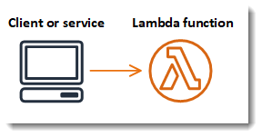

# Basic function with minimal dependencies (Java)



The project source includes function code and supporting resources:

## Requirements

* JDK 11
* [The AWS CLI](https://docs.aws.amazon.com/cli/latest/userguide/cli-chap-install.html)

## Deploy & Undeploy

Go to [`../infra`](../infra) directory and follow its instructions.

## Test

To invoke the function, run:

```sh
make invoke
```
